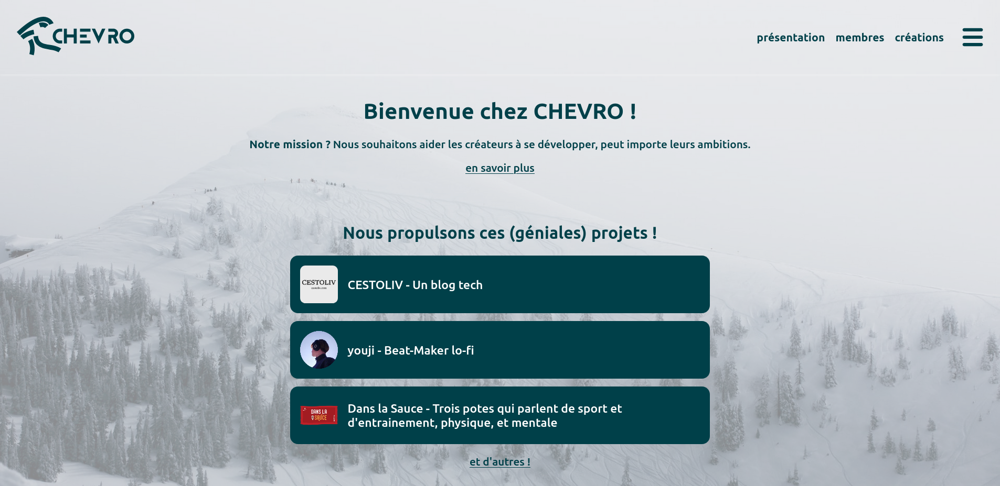
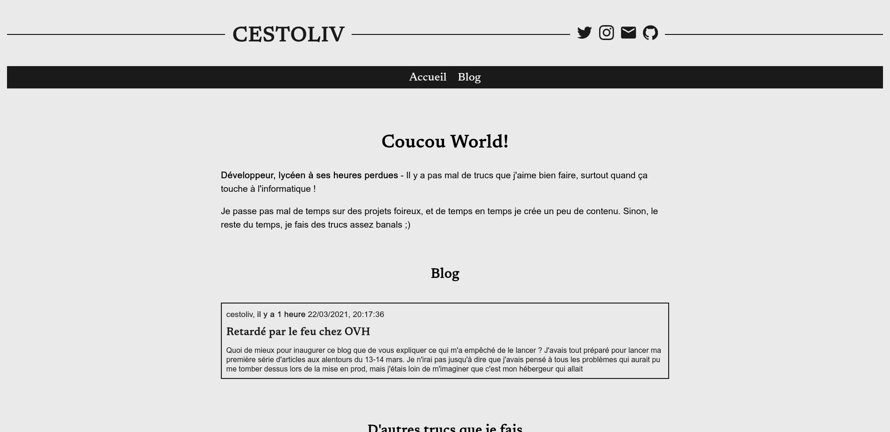
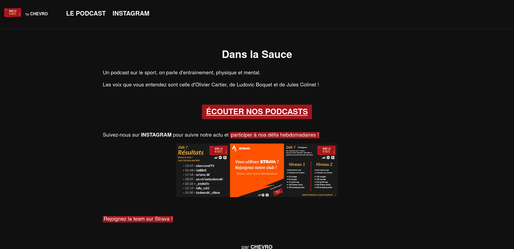
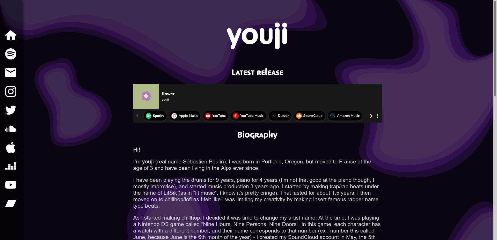

 

 

# CESTMADDY
## Hi ! You made the right choice.
**You came to use cestmaddy, didn't you?**

*cestmaddy* is an **OpenSource** CMS, very light, full of functionality and customizable, based on markdown files.

You will be able to create static pages, but also create blogs and host podcasts!

## Self-hosted
cestmaddy is self-hosting, [here's how to install it](https://cestmaddy.cestoliv.com/documentation/installation) (I promise, it's easy)

## Website created with CESTMADDY

 

| | [CHEVRO website](https://chevro.fr), made with CESTMADDY and the [CHEVRO theme](https://github.com/CHEVROfr/cestmaddy-theme-chevro) !|
|:---:|---|
||[CESTOLIV website](https://cestoliv.com), made with CESTMADDY and the [WAVE theme](https://github.com/cestoliv/cestmaddy-theme-wave) !|
||[DANS LA SAUCE website](https://danslasauce.chevro.fr), made with CESTMADDY and the [DANS LA SAUCE theme](https://github.com/CHEVROfr/cestmaddy-theme-danslasauce) !|
||[YOUJI website](https://youjimusic.com/), made with CESTMADDY and the [YOUJI theme](https://github.com/CHEVROfr/cestmaddy-theme-youji) !|